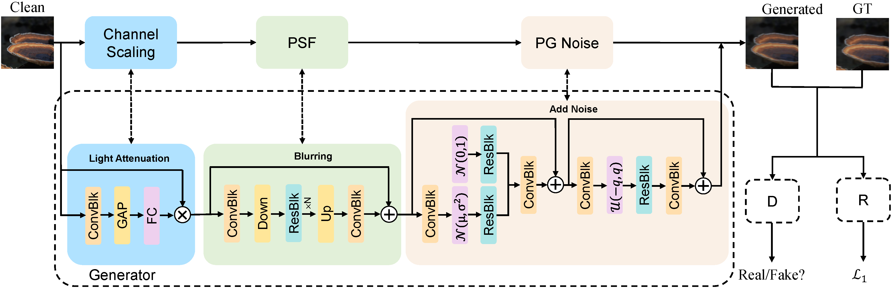
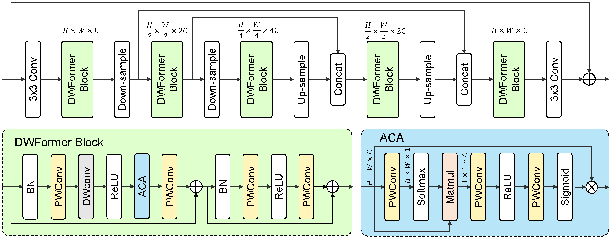

# Modular Degradation Simulation and Restoration for Under-Display Camera
[](https://arxiv.org/abs/2209.11455) 
[](https://drive.google.com/drive/folders/10NJnCFcnpl_iEXFFdS2dRWhOi9Wt6Xxr?usp=sharing)
>**Abstract:**
Under-display camera (UDC) provides an elegant solution for full-screen smartphones. However, UDC captured images suffer from severe degradation since sensors lie under the display. Although this issue can be tackled by image restoration networks, these networks require large-scale image pairs for training. To this end, we propose a modular network dubbed MPGNet trained using the generative adversarial network (GAN) framework for simulating UDC imaging. Specifically, we note that the UDC imaging degradation process contains brightness attenuation, blurring, and noise corruption. Thus we model each degradation with a characteristic-related modular network, and all modular networks are cascaded to form the generator. Together with a pixel-wise discriminator and supervised loss, we can train the generator to simulate the UDC imaging degradation process. Furthermore, we present a Transformer-style network named DWFormer for UDC image restoration. For practical purposes, we use depth-wise convolution instead of the multi-head self-attention to aggregate local spatial information. Moreover, we propose a novel channel attention module to aggregate global information, which is critical for brightness recovery. We conduct evaluations on the UDC benchmark, and our method surpasses the previous state-of-the-art models by 1.23 dB on the P-OLED track and 0.71 dB on the T-OLED track, respectively.

### Generator Architecture —— MPGNet

### Restoration Architecture —— DWFormer

## Get Started

### Install
We test the code on PyTorch 1.12.0 + CUDA 11.3 + cuDNN 7.5.0.

1. Create a new conda environment
```
conda create -n pt1102 python=3.7
conda activate pt1102
```

2. Install dependencies
```
conda install pytorch=1.12.0 torchvision torchaudio cudatoolkit=11.3 -c pytorch
pip install -r requirements.txt
```

### Download
You can download the datasets on [GoogleDrive](https://drive.google.com/drive/folders/10NJnCFcnpl_iEXFFdS2dRWhOi9Wt6Xxr?usp=sharing)
We provide the real datasets and the generated UDC DIV2K dataset for the Poled and Toled tracks.
The data file path should be same as following:
```
--data
  |—Train
  |  |—Poled
  |  |  |—Degraded images
  |  |  |—GT
  |  |—Toled
  |  |  |—Degraded images
  |  |  |—GT
  |
  |—Val
  | |-...
  |—Test
  | |-...
```

### Train
You can modify the training settings for each experiment in the `configs` folder.
Then run the following script to train the model:
```
Python train_MPGNet.py --category (Poled or Toled)
Python train_DWFormer.py --category (Poled or Toled)
```
